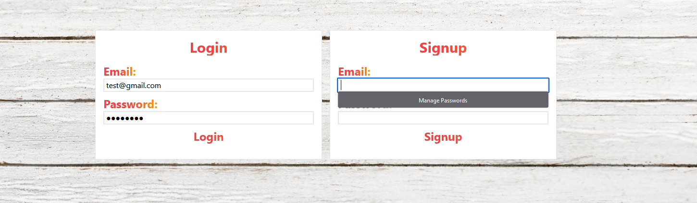
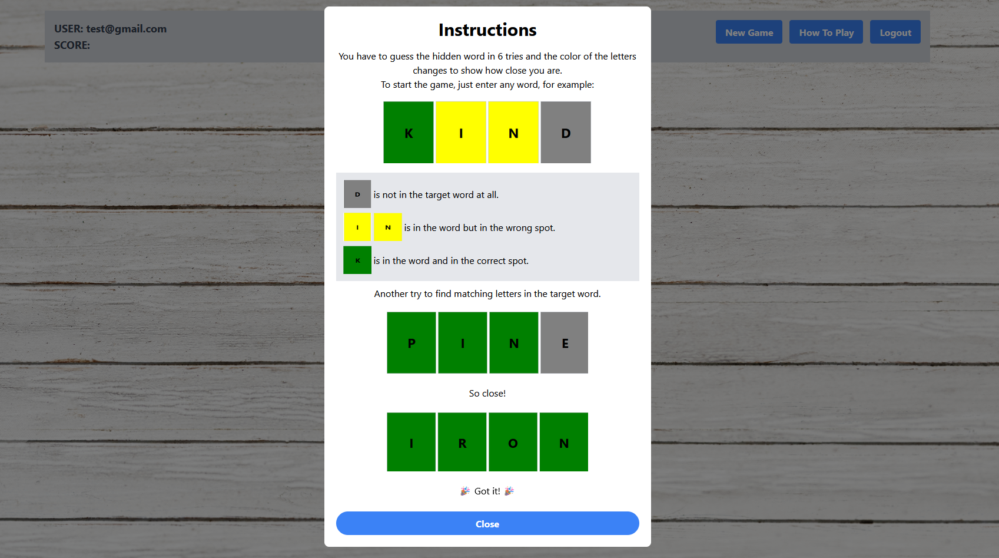
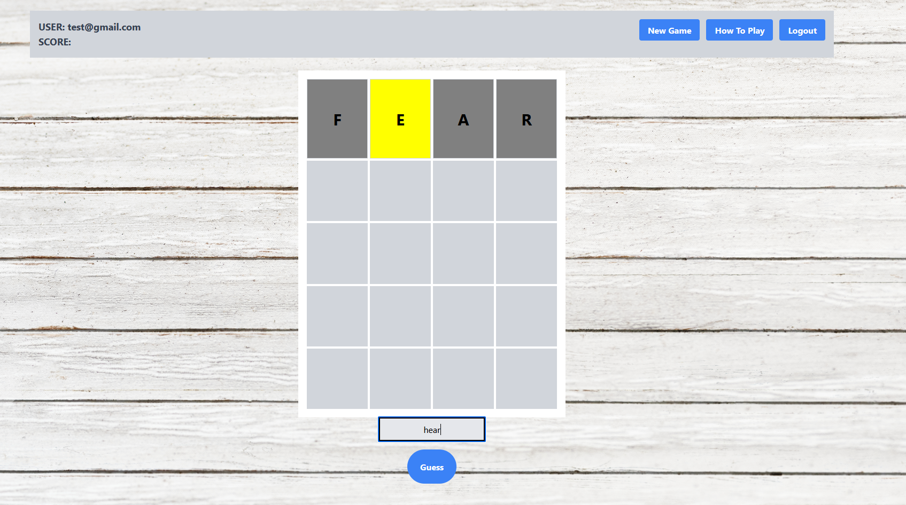
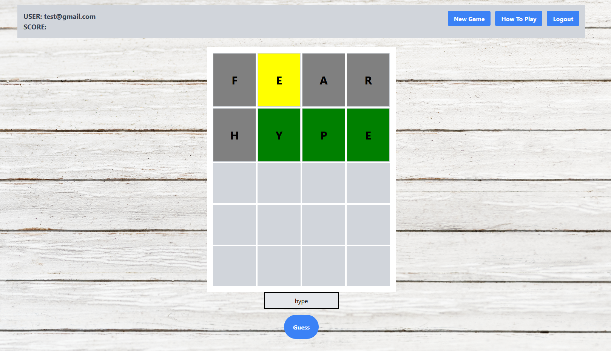
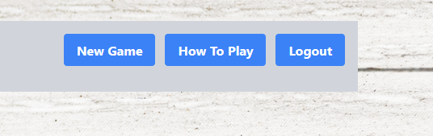

# Nerdle Word Game
[](https://opensource.org/licenses/MIT)

This project is a backend API for a Wordle-like game, where users guess words within a certain number of attempts. It's built with Node.js, Express, Sequelize, MySQL, and uses dotenv for environment configuration.

## Features

- User registration and authentication
- Word guessing game logic
- Secure password storage
- Environment-based configuration

## Prerequisites

Before you begin, ensure you have met the following requirements:
- You have a **Node.js** environment installed (version 12.x or later).
- You have **MySQL** installed and running on your machine.
- You are familiar with **Git** commands.

## Getting Started

These instructions will get you a copy of the project up and running on your local machine for development and testing purposes.

### Installation

1. **Clone the repository**


        git clone https://github.com/relaxjoe/wordgame.git
        cd wordgame

2. Begin by starting the server by running,

        npm start
    - the cmd will provide the URL top open the webpage

    ```
    Server listening at http://localhost:3001
    ```


# Usage
Login: 
- Start by logging into your account. If you don't have an account yet, you can sign up quickly to start playing.

    

Game Instructions: 
- Need help getting started? Click on the "Instructions" button to learn how to play Wordle.

    

Guess the Word:
- Once you're ready, start guessing! Enter a 4-letter word into the input field and submit your guess. You have 5 tries to get it right.

    

Feedback:
- After each guess, you'll receive feedback on your word:
    - Green: Correct letter in the correct position.
    - Yellow: Correct letter, but in the wrong position.
    - Gray: Letter is not in the word.
    - Winning: If you guess the word correctly within 5 tries, congratulations! You win the game.

    

Restart:
- Want to play again? Simply click the "New Game" button to start a new round of Wordle.

Logout:
- When you're done playing, don't forget to logout for security.

    

Tips:

Use the feedback from each guess to narrow down the possibilities.
Think strategically and use logic to deduce the secret word.
Are you up for the challenge? Login now and let's play Wordle!

# license 
The MIT License (MIT)

Copyright (c) 2015 Chris Kibble

Permission is hereby granted, free of charge, to any person obtaining a copy of this software and associated documentation files (the "Software"), to deal in the Software without restriction, including without limitation the rights to use, copy, modify, merge, publish, distribute, sublicense, and/or sell copies of the Software, and to permit persons to whom the Software is furnished to do so, subject to the following conditions:

The above copyright notice and this permission notice shall be included in all copies or substantial portions of the Software.

THE SOFTWARE IS PROVIDED "AS IS", WITHOUT WARRANTY OF ANY KIND, EXPRESS OR IMPLIED, INCLUDING BUT NOT LIMITED TO THE WARRANTIES OF MERCHANTABILITY, FITNESS FOR A PARTICULAR PURPOSE AND NONINFRINGEMENT. IN NO EVENT SHALL THE AUTHORS OR COPYRIGHT HOLDERS BE LIABLE FOR ANY CLAIM, DAMAGES OR OTHER LIABILITY, WHETHER IN AN ACTION OF CONTRACT, TORT OR OTHERWISE, ARISING FROM, OUT OF OR IN CONNECTION WITH THE SOFTWARE OR THE USE OR OTHER DEALINGS IN THE SOFTWARE.